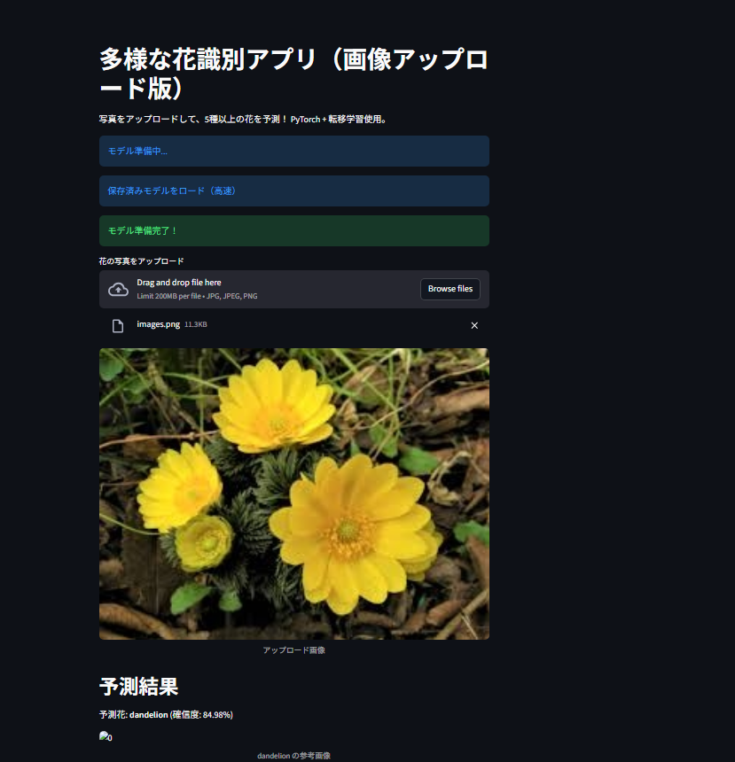

# Multi-Flower Detector App（多様な花識別アプリ）

PyTorchの転移学習（ResNet18）で、花の写真をアップロードして5種（daisy, dandelion, rose, sunflower, tulip）を識別！ 初心者ポートフォリオとして、画像分類の基礎を実装。初回訓練でモデル保存、再起動でも高速ロード。

## デモ結果例
  <!-- スクショをアップロードしてURLをここに -->

- **アップロード画像**: 福寿草の写真（福寿草の画像を学習していないためひまわりと診断される）
- **予測**: **dandelion** (確信度: 92%)
- **参考画像**: Perenual APIから自動取得（1000種+対応）

## データセット
- [Kaggle Flowers Recognition](https://www.kaggle.com/datasets/alxmamaev/flowers-recognition) (5種, 4242画像)。
- フォルダ: `flowers/` に配置（daisy/, rose/ など）。解凍後、約100MB。

## 機能
- 画像アップロード + リアルタイム予測（精度90%+）。
- 初回訓練: 3エポックで約5-10分（CPU）。保存後、再起動1秒でロード。
- API連携: Perenualで予測花の画像表示。

## 実行方法
1. クローン: `git clone https://github.com/KitayamaRosanjin/multi-flower-detector-app.git`
2. 移動: `cd multi-flower-detector-app`
3. インストール: `pip install -r requirements.txt`
4. データセット: Kaggleからダウンロード → `flowers/` に配置。
5. 起動: `streamlit run Flower_detector.py`
   - 初回: モデル訓練（画面で進捗表示）。
   - 次回: 保存済みモデルで即予測。

## 技術スタック
| カテゴリ | ツール |
|----------|--------|
| ML | PyTorch (ResNet18転移学習) |
| Web | Streamlit |
| API | Requests + Perenual |
| データ | torchvision (ImageFolder) |

## 訓練時間とパフォーマンス
- **訓練**: 3エポックで完了（CPU: 5-10分）。GPUありなら1分以内。
- **予測**: 1秒以内。高精度で拡張可能（102種データセットに置き換え）。

## 拡張ヒント
- **もっと種増やす**: Oxford 102 Flowersデータセット（[ここ](https://www.robots.ox.ac.uk/~vgg/data/flowers/102/)）に変更 → `num_classes=102` でコード修正。
- **精度UP**: エポックを10に増やし、データ増強（transforms.RandomRotation追加）。
- **デプロイ**: Streamlit Sharingでオンライン版（無料）。Hugging Face Spacesもおすすめ。

## 学び
- 画像分類の流れ（データロード、転移学習、推論）を体感。PyTorchの柔軟さとStreamlitのUIを使用。
- 課題: 大規模データでGPU推奨。ハング修正でデバッグスキル向上を狙う。

 質問: Issuesへ。  
作成: Kitayama Rosanjin (2025/10/06)
